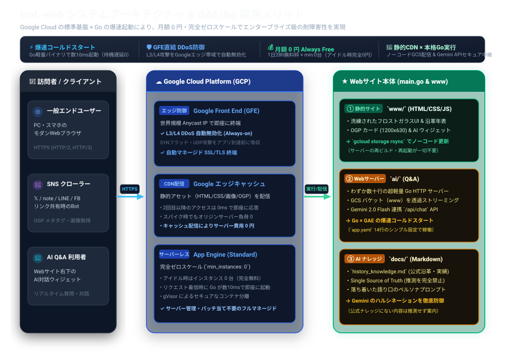

# trot-web システムアーキテクチャ & 設計資産完全解説

「Google の巨大インフラ（GFE / DDoS 防御 / エッジキャッシュ）を標準装備し、Gemini AI + Slack 通知を統合して月額 0 円・完全ゼロスケールで稼働するエンタープライズ級 Web アーキテクチャ」の設計思想と資産解説です。

---

## 🗺️ システム接続図 (System Architecture)



> [!TIP]
> **設計の最大のポイント**:
> Google の世界規模のフロントエンド（Anycast, GFE, L3/L4 DDoS 防御, エッジキャッシュ）およびゼロスケール App Engine を「標準機能のまま」最大限に享受し、**自前で用意したのは「① バックエンド `main.go`」「② 静的サイト `www/`」「③ 公式ナレッジ `docs/`」の 3 つだけ** という極小・高耐久・ゼロコスト設計です。

---

## 🛡️ Google Cloud が標準提供するインフラ・セキュリティ基盤

個人や小規模企業が独自に構築すると莫大な費用と保守コストがかかる「エンタープライズ級のインフラ保護」が、本構成では**初期設定のまま自動適用**されます。

### 1. Google Front End (GFE) による常時 DDoS 緩和 (Always-on Protection)
* **Google 共通のフロントエンド基盤**:
  App Engine の手前には、Google 検索、YouTube、Gmail と同一のグローバル分散プロキシ網 **Google Front End (GFE)** が配置されています。
* **L3/L4 DDoS 攻撃の自動無効化**:
  SYN フラッド、UDP リフレクション、IP フラグメント攻撃などの大規模なインフラ層（Layer 3/4）DDoS 攻撃は、GFE の巨大な帯域（数十 Tbps 規模）によって**アプリケーションに到達する前に自動的かつ完全に吸収・緩和**されます。
* **Anycast IP & 最寄りの POP での接続終端**:
  世界各地の Google エッジ POP（Point of Presence）で SSL/TLS ハンドシェイクを即座に終端するため、世界中どこからアクセスしても極めて低いレイテンシでセキュアな接続が確立されます。

### 2. Google エッジキャッシュ（自動 CDN 効果）
* **HTTP ヘッダー連動のエッジ配信**:
  `main.go` から返却される `Cache-Control: public, max-age=...` ヘッダーに基づき、Google のエッジサーバーが静的アセット（HTML, CSS, JS, 画像, OGP）を自動キャッシュします。
* **2 回目以降のオリジン到達ゼロ**:
  アクセスが集中した場合でも、2 回目以降は App Engine や GCS に到達することなく、Google のエッジから数ミリ秒で直接レスポンスが返るため、**アクセス急増（スパイク）時でもサーバー負荷・費用が一切跳ね上がりません**。

### 3. App Engine 組み込みファイアウォール (App Engine Firewall)
* **インフラレイヤーでの IP フィルタリング**:
  アプリケーションコード（Go）を実行する手前のインフラ層で、特定の IP アドレスやサブネット（CIDR）からのアクセスを即座に拒否・許可できるルールを設定可能です。

### 4. gVisor / Borg によるセキュアなサンドボックス分離
* Google のコンテナ分離仮想化技術（gVisor 等）により、他のテナントや基盤からセキュアに隔離されたサンドボックス環境で Go バイナリが安全に実行されます。

---

## 🤖 Gemini AI ナレッジグラウンディング & トークン経済性設計

### 1. ナレッジグラウンディング（Single Source of Truth）
* **ハルシネーション（推測・でっち上げ）の徹底防止**:
  `docs/history_knowledge.md` 等の公式ナレッジをシステムプロンプトに動的注入。ナレッジにない事項の推測回答を固く禁止し、信頼性の高い対話応答を実現。
* **品格あるエンジニアペルソナ**:
  歴史や年数のあざとい誇示を排除し、質問に対してダイレクトかつ知的・スマートに回答するトーン＆マナーをプロンプトで制御。

### 2. トークン消費量と完全 $0 運用の成立根拠

| 項目 | トークン数 / 指標 | 備考 |
| :--- | :--- | :--- |
| **入力（Prompt Tokens）** | **約 4,500 〜 5,200 tokens** | システム指示 ＋ 社内公式ナレッジ（約17KB） ＋ 会話履歴 ＋ ユーザー質問 |
| **出力（Candidates Tokens）**| **約 150 〜 350 tokens** | AI アシスタントの回答文 |
| **1回あたりの合計消費** | **約 5,000 tokens** | 1リクエストの平均値 |
| **Gemini 3.6/2.5 Flash 無料枠**| **1,000,000 tokens/分** / **15 RPM** / **1,500 RPD** | Google AI Studio Free Tier |

> 💡 **経済性の根拠**:
> 1リクエストあたり 5,000 トークン消費しても、無料枠（1分間100万トークン）のわずか **0.5%** しか消費しません。
> 1日最大 1,500 回の対話まで **完全 0 円（無料枠）** で余裕を持って運用可能です。

### 3. Observability（トークン観測性）の組み込み
* Go バックエンド（`ai/gemini.go`）において、Gemini API レスポンスの `usageMetadata` をパースし、毎回のプロンプト・生成・合計トークン数をリアルタイムでログに記録。

---

## 📩 お問い合わせ・通知パイプライン設計 (`notify/`)

### 1. メアド非公開化による完全スパム防御
* Web サイト上に `info@trot.co.jp` 等のメールアドレスを平文で一切公開しない。
* 訪問者からの相談・問い合わせは、AI アシスタントが対話の中で「お名前」「ご連絡先」「ご相談要件」をヒアリング・要約し、ユーザーの合意を得た上で裏側からセキュアに転送。

### 2. 統合通知インターフェース (`notify.Notifier`)
```text
[AI アシスタント（要件ヒアリング完了）]
                  ↓
          /api/contact (Go)
                  ↓
       notify.NewNotifier().Send()
          ┌───────┴───────┐
          ▼               ▼
   【Slack Webhook】   【SendGrid / Email】
  （即時プッシュ通知） （審査開通後に同時配送）
```
* **環境変数連動の自動ルーティング**:
  * `SLACK_WEBHOOK_URL` が存在 ➡️ **Slack チャンネルへ即時リッチ通知**
  * `SENDGRID_API_KEY` が存在 ➡️ **指定メールアドレスへ自動配信**
  * 未設定時 ➡️ **標準ログへ安全にフォールバック**

---

## 🔒 セキュリティ & リポジトリ分離設計

### 1. 公開・非公開の境界分離
* **公開リポジトリ (`trot-web/`)**:
  * オープンソース / ポートフォリオ用として GitHub 公開。
  * API キー、Webhook URL、個人情報などの**生データ・シークレットは完全ゼロ（ハードコード一切なし）**。
  * すべて `os.Getenv(...)` 経由で注入。
* **非公開領域 (`secrets.env` / 親リポジトリ `agy-trot-web`)**:
  * 実キー・シークレットを親リポジトリの非公開領域で厳重管理。

### 2. GitHub Linguist 言語判定の最適化 (`.gitattributes`)
* 静的アセット（Webflow JS / CSS / HTML）に `linguist-detectable=false` および `linguist-vendored=true` を設定。
* GitHub 上のリポジトリ主要言語を **「Go 100%」** として正しく判定・表示。

---

## 📝 まとめ：極小・高耐久・ゼロコストの完成形

1. **Google インフラの恩恵（GFE + DDoS 自動防御 + エッジキャッシュ）を月額 0 円で獲得**
2. **Go 言語（GAE Standard ゼロスケール）による爆速・堅牢なバックエンド**
3. **Gemini 3.6 Flash による公式ナレッジ厳守の AI アシスタント（無料枠で成立）**
4. **Slack 即時通知 ＋ メール両対応によるスマートなお問い合わせ導線**
5. **公開・非公開が完全に分離された高セキュリティ設計**
